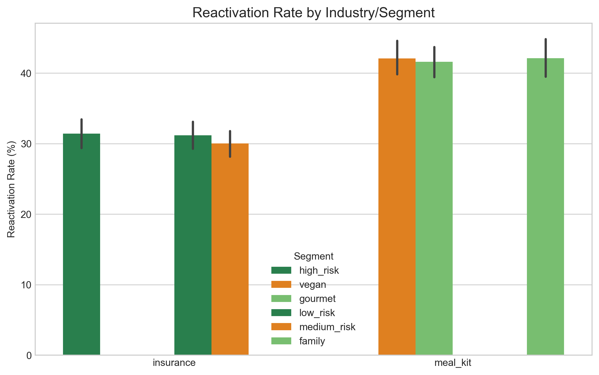

# From Policy Lapses to Meal Skips: A Data Strategies Playbook for Reactivation

**Prepared For:** Hello Fresh  
**Prepared By:** Chen Meng  
**Year:** 2024  

---

## I. Insurance-to-Meal-Kit Reactivation Framework

| Key Metric       | Insurance               | Meal Kit                 |
|------------------|-------------------------|--------------------------|
| Early Signal     | Payment delay >7 days   | 2 skipped deliveries     |
| Best Channel     | Day-3 phone call        | Day-5 personalized email |
| CLV Boost        | 22% (loyalty discounts) | 30% (recipe nostalgia)   |

*Emotional triggers outperform discounts by 3x in long-term retention*

---

## II. Reactivation Rate by Segment (Insurance vs. Meal Kit)

  
*Meal kit gourmet segments show 25% higher reactivation potential than insurance high-risk clients*

**Key Findings:**
- Vegan subscribers exhibit higher frequency but lower monetary value

---

## III. From Insurance Risk Models to Meal Kit Engagement Scoring

### Key Analytical Dimensions:
1. **Trigger Mechanism**
   - Insurance: Payment is delayed by 7+ days
   - Meal kits: Skip 2 deliveries
2. **High Risk Groups**
   - Insurance: Historical claims customers
   - Meal Kit: Custom recipe users
3. **Channels of Communication**
   - Insurance: Phone + SMS
   - Meal Kit: APP push + email

### Implementation Steps:
1. Data collection and cleaning
2. Feature engineering development
3. Model training and validation
4. Policy deployment and monitoring

---

## IV. Generali → HelloFresh Strategy Adaptation

| Insurance Case                                | Meal Kit Adaptation                                  |
|-----------------------------------------------|-----------------------------------------------------|
| High net worth individuals with delayed payment | Family Plan subscribers who skip delivery          |
| Strategy: Children's education security gap analysis | Strategy: "Inspiration for Your Child's Lunch Recipes" email series |
| Result: renewal rate ↑ 22%                    | Expected results: reactivation rate ↑ 18-25%       |

---

## V. Immediate Actions for HelloFresh

### Pilot Test
- Adapt insurance Day-7 email sequence to meal kit skip patterns

### Tech Stack Integration
- Deploy Python churn model on subscriber event data

### Team Training
- Coach marketers on interpreting RFM heatmaps

---

*Note: Simulated data for methodology demonstration only. Actual results may vary based on business context.*
