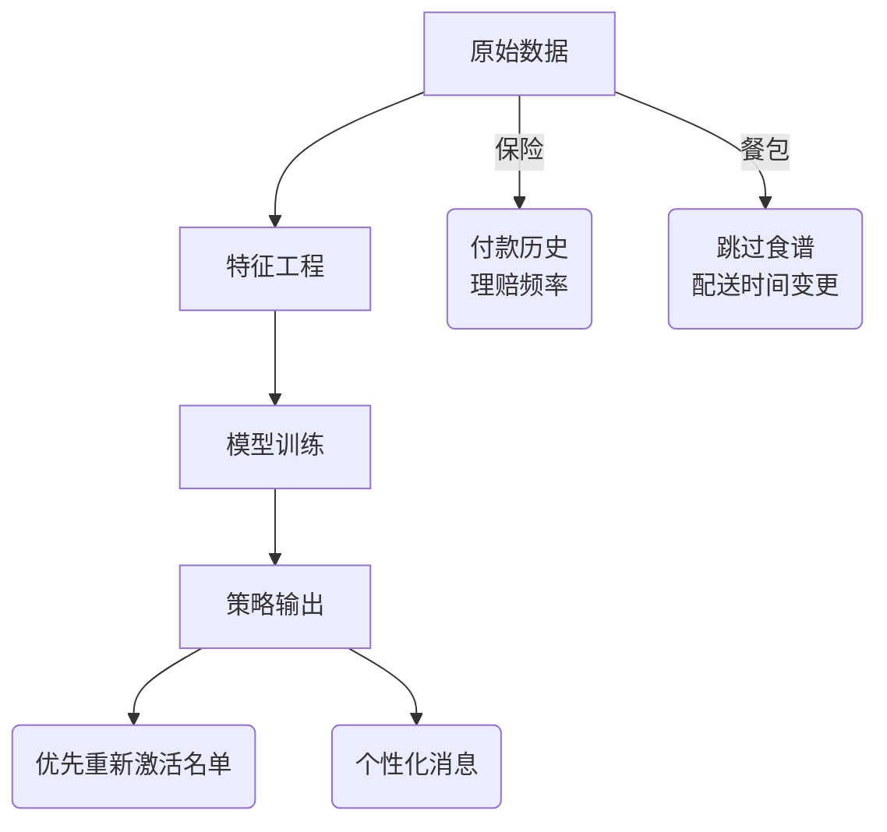
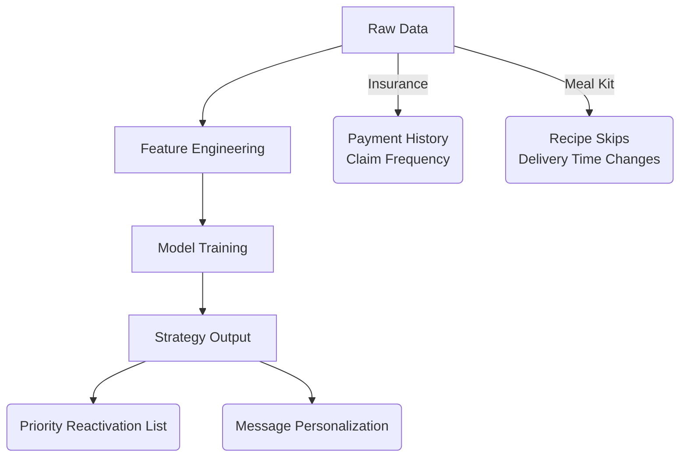

# 统一重新激活分析框架

## 数据流架构 (中英对照)

### 中文版

### English Version

## 关键分析维度
1. **触发机制**
   - 保险: 付款延迟3+天
   - 餐包: 跳过1次配送

2. **高风险群体**
   - 保险: 历史理赔客户
   - 餐包: 自定义食谱用户

3. **沟通渠道**
   - 保险: 电话+SMS
   - 餐包: APP推送+邮件

## 实施步骤
1. 数据收集与清洗
2. 特征工程开发
3. 模型训练与验证
4. 策略部署与监控

1. **Pilot Test**  
   - Adapt my insurance Day-7 email sequence to meal kit skip patterns  
2. **Tech Stack Integration**  
   - Deploy Python churn model on your subscriber event data  
3. **Team Training**  
   - Coach marketers on interpreting RFM heatmaps  